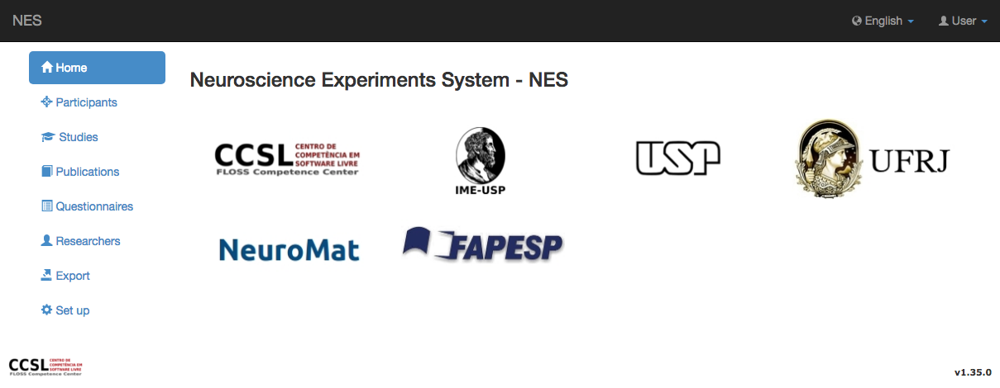
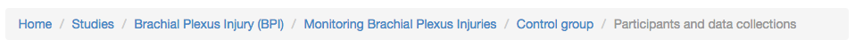

.. _userguide:

User Guide
==========

NES current version supports the creation and management of :ref:`participants`, :ref:`studies`, :ref:`questionnaires`, and :ref:`researchers`. To navigate in the system, use the vertical menu in the left. The home screen of NES can be accessed by the `Contact` menu item. It shows the institutions involved in the development of NES.

**Participants** are people who take part in experiments.

**Studies** are research projects with a collection of :ref:`experiments` developed by researchers.  

**Questionnaires** have to be answered by participants and might or not be related to experiments.

**Researchers** can be included in groups of users (roles) in order to have specific :ref:`permissions` and access restricted functionalities of the system. 

On the top of most of the pages of NES, you can see a `breadcrumb <https://en.wikipedia.org/wiki/Breadcrumb_(navigation)>`_.

Each link is a shortcut that allows you to go back to the specific screen. For example, if you want to go back to the Participants screen, you do not need to click *Back* button many times, but go directly to there through the Participants link.
